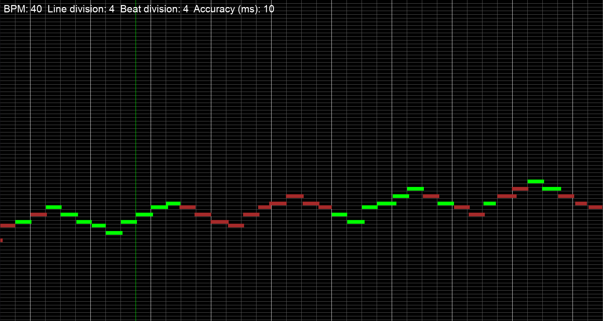

('statistics' branch for developing saving and processings user's progress)

# Hanon — MIDI-Based Finger Independence Trainer

**Hanon** is an experimental tool designed to develop *finger independence and rhythmic precision* in piano technique especially suited for Hanon exercises and other repetitive technical patterns.

Instead of just showing notes, Hanon measures your exact timing accuracy in real time (with 10 ms precision) and gives instant visual feedback. The goal isn’t speed, it’s consistency.

When your timing becomes microscopically precise, speed and control follow naturally.

---

## The Theory

If your technique feels stuck, the reason is almost always tiny timing inaccuracies so small that you can’t consciously detect them.
These micro-errors accumulate at higher tempos and make your playing uneven, even if you “feel” like you’re in time.

> **J.S. Bach: "There's nothing remarkable about it. All one has to do is hit the right keys at the right time and the instrument plays itself.”**

The only way to fix these inaccuracies is to measure and train at the smallest perceivable time scale so that they become automatic. If you only practice with a metronome you are not putting enough effort in the timing of individual notes. Instead, you are adjusting the overall speed to the beats.

A trained musician can consciously perceive around a time unit of 10 ms. That’s the level Hanon measures and displays.

At first, hitting that precision feels almost impossible. But as you improve, your fingers begin to internalize an exact temporal spacing between notes, the foundation of clean, expressive playing.


---

## How It Works

1. **Connect your digital piano or MIDI keyboard.**
2. **Create a virtual environment for Python**
3. **Adjust MIDI input and output ports in midi_routine.py**
4. **Run Hanon.**
   ```bash
   python3 main.py 40
   ```

The first argument is tempo in BPM.


# Technical Principles
## Single Master Clock

Both the graphics and the MIDI metronome are synchronized to the same continuous time source:

pygame.midi.time()


This guarantees perfect phase-lock between what you see and what you hear, no drifting, no uneven ticks. All motion, grid timing, and metronome clicks are derived from the same master clock.

## Continuous Grid System

Two scrolling grids (A and B) alternate seamlessly:

When one grid scrolls off-screen, the next one takes over and a new grid instance is created outside of the right border of the screen.

Notes that extend past the boundary continue smoothly to the next grid. This done by splitting a note in two.

This double-buffered structure ensures uninterrupted scrolling and consistent timing.

***Important note***

Variables:

self.bpm -> Tempo

self.line_division -> How many vertical lines a beat is divided into. This means the intended duration of the note. If you are going to play 16th notes, the beat must be divided in 4. Because the program compares accuracy to the nearest vertical line, you won't get correct results if intended note duration doesn't match with the line division

self.beat_division -> How many metronome ticks is played in each beat. On slower tempos this should match with the line division so that you hear a metronome tick at every note and can adjust the timing of each finger movement.

## MIDI Metronome

Instead of audio playback, the app sends MIDI note 42 on channel 9 (hi-hat sound in General MIDI).
Your piano plays its own metronome tightly synced with the graphics.

## Real-Time MIDI Listening

Incoming MIDI events are read in a dedicated thread and placed in a queue.
Each note’s timestamp is compared to the nearest vertical grid line to calculate accuracy.

## Controls
Q	Quit program
Other keys are currently not in use. This will be added later. You have to change the tempo by starting the program again with a new BPM argument.

## Practice Philosophy

Goal: Maximize green hits — not speed.

Method: Play simple, repetitive patterns (e.g. Hanon) slowly and aim for perfect timing.

Result: Your fingers will begin to memorize time intervals, not just motion patterns.

When your muscle memory aligns with true rhythmic precision, technique and relaxation improve together.

***CAUTION!***
Hands must be relaxed at all times.
If you feel any pain, **STOP** immediately, and consult your doctor and/or a professional piano teacher.
This is an experimental software and I take no responsibility for any injuries or damages.

## Requirements (tested)

Python 3.10 +

pygame


Install dependencies:

pip install pygame


Connect your MIDI keyboard via USB before launching. 

## Repository Structure
main.py           → main loop, graphics & event control
midi_routine.py   → MIDI I/O, metronome thread, synchronization
pianoroll.py      → grid generation, note rendering, accuracy logic
settings.py       → configurable parameters (BPM, divisions, accuracy)


## Experimental Notes

The system assumes your MIDI device sends Note On and Note Off messages accurately.

For best results, disable any local keyboard latency settings.

The visual feedback loop works best with Hanon exercises, because the repetitive structure allows you to isolate and adjust individual finger timing.

Still, you can play anything you like.

## Future Directions

* Cleaning up and refactoring the code.
* Changing tempo, accuracy margin, beat and line division in real time. This requires resetting all objects which is difficult because the pygame.midi.time() runs continously. It can't be reset. Suggestions are welcome.

* Per-finger accuracy statistics. Log timing data for long-term progress tracking

Have fun practising!

Janne Kankaala

